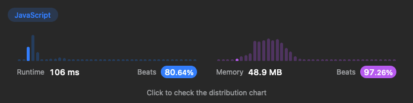

# 155. Min Stack

Design a stack that supports push, pop, top, and retrieving the minimum element in constant time.

Implement the MinStack class where:

- MinStack() initializes the stack object.
- .push(value) pushes the element value onto the stack.
- .pop() removes the element on the top of the stack.
- .top() gets the top element of the stack.
- .getMin() retrieves the minimum element in the stack.

The solution requires each function to have O(1) time complexity.

## Solution

This leetcode solution implements a Stack data structure with an added functionality of maintaining the minimum value in the stack.

The solution uses two arrays, the stack array for storing the elements and the minStack array for storing the minimum values.

The push, pop and top methods are all very simple to achieve in O(1) time.

In order to be able to access the minValue in O(1) time, which is the real challenge in my opinion, the solution keeps track of the minimum value in the stack by using a separate minStack array.

Every time an element is pushed onto the stack array, the solution checks if it is less than or equal to the current minimum value (which is represented by the top element of the minStack array).

If the new element is less than or equal to the current minimum value, the solution pushes it onto the minStack array.

When an element is popped from the stack array, the solution checks if it is the same as the current minimum value (which is again represented by the top element of the minStack array). If it is the same, the solution pops it from the minStack array, effectively updating the minimum value in the stack.

This way, the top (last) element in the minStack array always contains the minimum value currently in the stack array, and the getMin function returns the top element of the minStack array in constant time.
