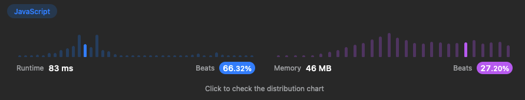
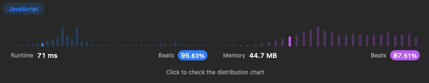

# 1921. Concatenation of Array

Given an integer array nums of length n, you want to create an array ans of length 2n where ans[i] == nums[i] and ans[i + n] == nums[i] for 0 <= i < n (0-indexed).

Specifically, ans is the concatenation of two nums arrays.

### Solution 1



A simple one line response, returning a new array created using the spread operator, and concatenating nums with itself:

```js
return [...nums, ...nums];
```

### Solution 2



By creating an empty array, and looping over nums, pushing nums[i] to the result[i], and nums[i] to result[i+nums.length]:

```js
const result = [];
for (let i = 0; i < nums.length; i++) {
  result[i] = nums[i];
  result[i + nums.length] = nums[i];
}
return result;
```

Both solutions have a time and space complexity of O(n), however the loop solution performs far better in Leetcode's tests than the spread operator.
